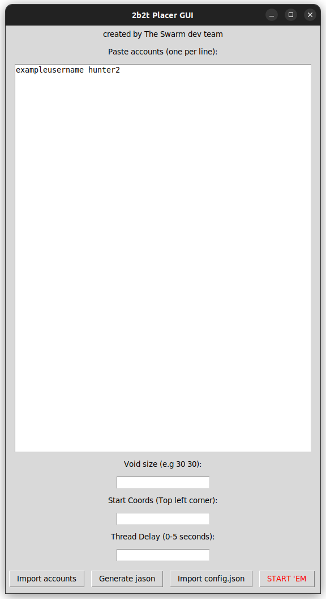

# 2b2t Placer GUI

GUI for configuring and running [2b2t's placer bot](https://github.com/WorldObservationLog/reddit-place-script-2023) for r/place '23.

## Deps
- pillow (`sudo pip3 install pillow`)
- tkinter (`sudo apt install python3-tk`)

## How run?
just `python3 gui.py`

## License
see license.md
